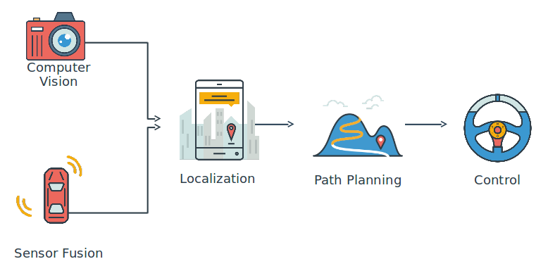

# Udacity Self-Driving Car Nanodegree



## Autonomous Vehicle Stack Summary

Autonomous vehicle system architecture starts with the perception system that estimate the surrounding environment (landmarks, vehicles and pedestrians). The information is used to localize the vehicle on a map. Path planning model charts a trajectory using environmental model, map and vehicle location. Finally the control loop applies the actuator to follow the planned trajectory. This reference trajectory is usually a 3rd degree polynomial. 

This repository contains my implementation to Udacity Self-Driving Car Nanodegree projects, some personal note keeping, and useful bash scripts to spin up the working environment quickly.

The entire Nanodegree is broken down into 3 terms. You can find the individual project repository for each term under the `term1/projects` for example.

## Term 1

### Miniconda Environment

1. Activate

    ```
    source activate carnd-term1 
    ```

2. Deactivate

    ```
    source deactivate
    ```

### Docker Environment

1. Running the term1 starter kit

    ```
    docker run -it --rm -p 8888:8888 -v `pwd`:/src udacity/carnd-term1-starter-kit
    ```


