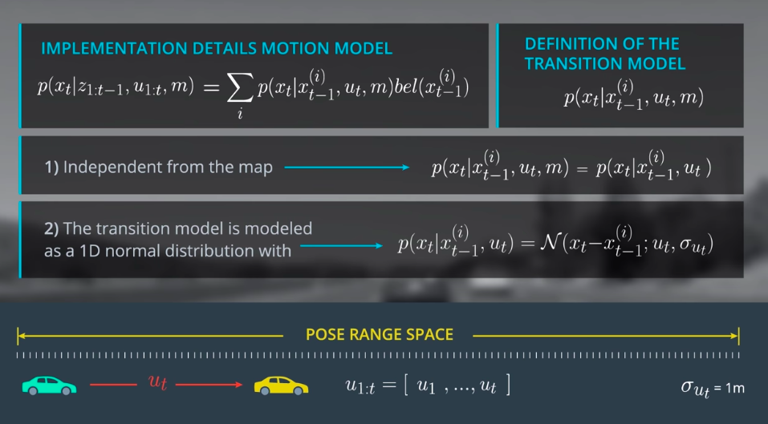
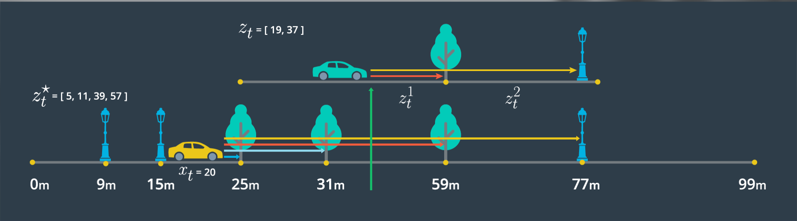

## Bayes Filter for Localization (Markov Localization)

Bayes filter is a recursive procedure to predict the probability distribution of car's location with the 1st order Markov assumption that the prediction at `x_t` only depends on `x_t-1`. NOTE: this is a recursive procedure. 

This provide a framework to keep an internal state car's current location where the motion model predicts the probability distribution at the next time period and the observation model updates the filter's internal state using the current measurments and controls. NOTE: this two-step update/predict procedure mirrors that of the Kalman Filter.

## Motion Model

The motion model is consisted of the following steps:

    For each x_t:
        a. Calculate the transition probability for each potential value x_t-1 	
        b. Calculate the discrete motion model probability by multiplying the transition model probability by the belief state (prior) for x_t-1 
        c. Return total probability (sum) of each discrete probability

## Observation Model

The observation model will be implemented by performing the following at each time step:

    1. Measure the range to landmarks up to 100m from the vehicle, in the driving direction (forward)
    2. Estimate a pseudo range from each landmark by subtracting pseudo position from the landmark position
    3. Match each pseudo range estimate to its closest observation measurement
    4. For each pseudo range and observation measurement pair, calculate a probability by passing relevant values to norm_pdf: norm_pdf(observation_measurement, pseudo_range_estimate, observation_stdev)
    Return the product of all probabilities
