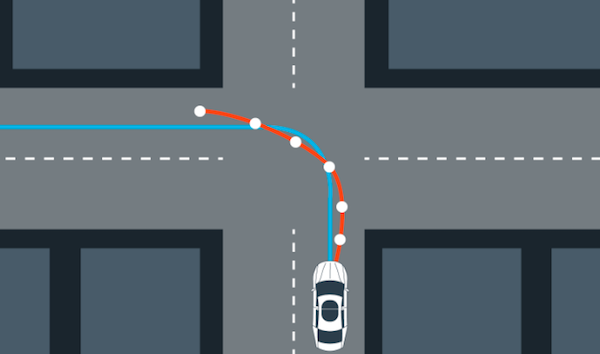
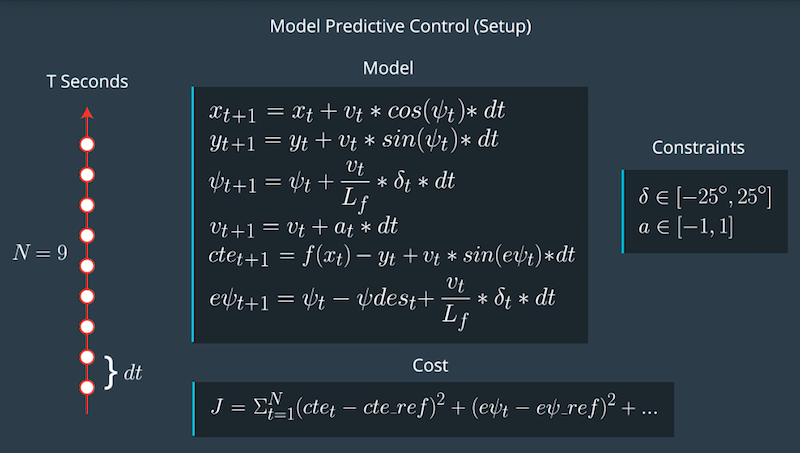

# Model Predictive Control (Receding Horizon Control)



Reframe the task of following a trajectory as an optimization problem of minimizing a cost function. We need to constantly recalculate the optimal trajectory to take into account of errors in the actuators (calculating inputs over a future horizon).

## Cost Function

A naive cost function may be an accumulated sum of all the errors in the displacement between planned vs actual trajectory and orientation (cross track error {**CTE**})

```
for (int t = 0; t < N; t++) {
    cost += pow(cte[t], 2);
    cost += pow(epsi[t], 2);
}
```

However, this naive approach may cause the agent to **stop**. A modification can be made to penalize the agent for not maintaining a referenced velocity:

```
    cost += pow(v[t] - REFERENCE_VELOCITY, 2)
```

For a smoother control (i.e. lane changing), we can also penalize the cost of sharp turning angle. We can establish this by penalizing both the **magnitude** or **rate of change**:

```
    cost += pow(delta[t], 2) # Magnitude
    
    #OR
    
    cost += pow(delta[t+1] - delta[t], 2) # Rate of Change
    cost += pow(a[t+1] - a[t], 2)
```

## Prediction Horizon

The prediction horizon is the duration over which future predictions are made. We’ll refer to this as T.

T is the product of two other variables, N and dt.

N is the number of timesteps in the horizon. dt is how much time elapses between actuations.

N, dt, and T are hyperparameters needed to be tuned. There are some general guidelines. T should be as large as possible, while dt should be as small as possible.

These guidelines create tradeoffs.

## Horizon

In the case of driving a car, T should be a few seconds, at most. Beyond that horizon, the environment will change enough that it won't make sense to predict any further into the future.

## Number of Timesteps

The goal of Model Predictive Control is to optimize the control inputs: [δ,a]. An optimizer will tune these inputs until a low cost vector of control inputs is found. The length of this vector is determined by N:

```[δ_1, a_1, δ_2, a_2 , ..., δ_N-1, a_N-1]``

Thus N determines the number of variables optimized by the MPC. This is also the major driver of computational cost.

## Timestep Duration

MPC attempts to approximate a continuous reference trajectory by means of discrete paths between actuations. Larger values of dt result in less frequent actuations, which makes it harder to accurately approximate a continuous reference trajectory. This is sometimes called "discretization error".

A good approach to setting N, dt, and T is to first determine a reasonable range for T and then tune dt and N appropriately, keeping the effect of each in mind.

## Latency

MPC can handle latency in our calculation and computation for optimal control inputs. The motion model can take into account of such latency by adding noise to the elapsed time interval.

Another approach is to run a simulation using the vehicle model starting from the current state for the duration of the latency. The resulting state from the simulation is the new initial state for MPC.

## Model Predictive Control Algorithm

