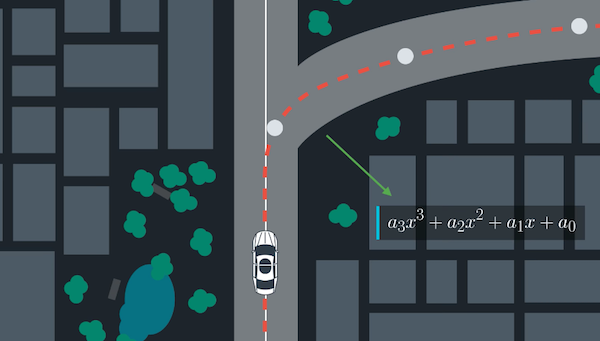
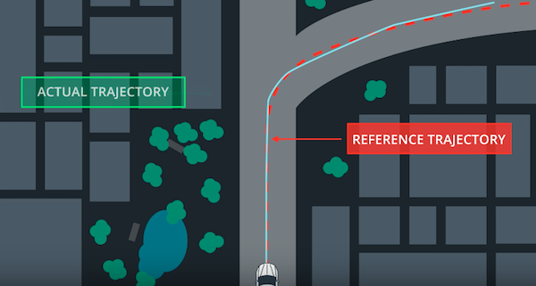
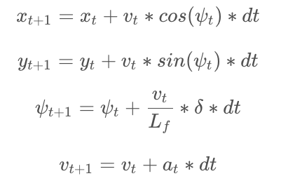
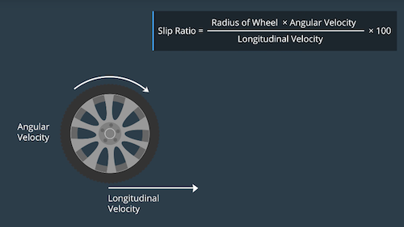
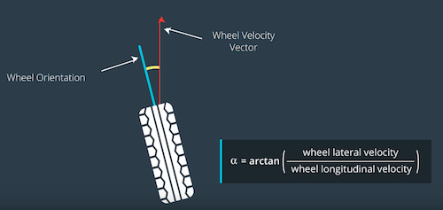

# Vehicle Models

Path planning model charts a trajectory using environmental model, map and vehicle location. Finally the control loop applies the actuator to follow the planned trajectory. This reference trajectory is usually a 3rd degree polynomial. 

## Error

The error is estimated by calculating the difference of the target trajectory and the predicted trajectory (we can predict the position at t+1 using the motion model).

Couple parameters we want to minimize:
1. **distance** b/w predicted and targeted trajectory
2. difference b/w vehicle **orientation** and trajectory orientation

## Kinematic Model
### Simple model that ignores gravity and tire forces 

`L_f` measures the distance between the center of mass of the vehicle and it's front axle. The larger the vehicle, the slower the turn rate.

If you've driven a vehicle you're well aware at higher speeds you turn quicker than at lower speeds. This is why vv is the included in the update.

### How `L_f` was chosen:

On the topic of running a vehicle around in a circle, this is actually a good way to test the validity of a model! If the radius of the circle generated from driving the test vehicle around in a circle with a constant velocity and steering angle is similar to that of your model in the simulation, then you're on the right track. This type of approach was used to tune `L_f`.

## Dynamic Model

### Forces:
* Longitudinal (Forward/Backward)
    * Slip Ratio 
    
    
* Lateral (Side to Side)
    * Slip Angle
    

## Simplistic vs Complex Models:

[Paper to read for reference](http://borrelli.me.berkeley.edu/pdfpub/IV_KinematicMPC_jason.pdf)

* Kinematic Model
    * Fewer parameters (2)
    * Real time
    * Transferable to different vehicle with different masses (**Reusability**)

* Dynamic Model
    * Accurate description 

## Actuator Constraints

Actuator is physically limited to a range of value (e.g. Steering Angle: [-30, +30], Brake: [-1, 1] or [Full Brake, Full Acceleration])

## Additional Resources

* [Pacejka Tire Model](http://www.theoryinpracticeengineering.com/resources/tires/pacejka87.pdf)
* [Springer Brakes, Brake Control and Driver Assistance Systems](./springer_control.pdf)
* [Drew Gray's Dissertion Thesis](https://escholarship.org/uc/item/1s2777sr)
* [Springer Vehicle Dynamics and Control](https://www.springer.com/us/book/9781461414322)