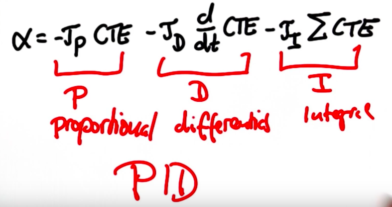

# CarND-Controls-PID
Self-Driving Car Engineer Nanodegree Program

---

## Proportional Integral Derivative (PID) Controller



* **prorportional:** gets a closer steering to the target direction proportional to the cross track error
* **Integral:** address the systematic bias of the model
* **Derivative:** prevents steering from overshooting


## Parameter Optimization

We need to optimize the control gains for each of the PID section (the different taus). Given the simplicity of this project, I decided to manually find these parameters. I use the PID controller to adjust both the steering and the throttle of the car in the simulation, and the idea behind is that in addition to turning the wheels, the car should also be slowing down (decrease the throttle) when the cross track error is relatively high (i.e. when making a turn).

Therefore, there are 6 constants: 

  * `STEERING_KP`: Proportional gain for the steering PID control
  * `STEERING_KI`: Integral gain for the steering PID control
  * `STEERING_KD`: Derivative gain for the steering PID control
  * `THROT_KP`: Proportional gain for the throttle PID control
  * `THROT_KI`: Integral gain for the throttle PID control
  * `THROT_KD`: Derivative gain for the throttle PID control

However, we would only consider the proportional and derivate gain as the simulation does not have any system bias that we may need to account for with integral gain.

I started with setting the all the constant zero but `STEERING_KP` and `THROT_KP` both as 0.1. The car oscillate heavily around the center of the lane and brakes every now and then. Next I increase the `STEERING_KD`, and the suppression of such oscillation is immediate. The car was able to drive smoothly at 20 mph, so I repeat similar step when increase the cruise at 40 mph then 60 mph.

Here are the final values:

    // PID gain constants
    static const double STEER_KP = 0.08;
    static const double STEER_KI = 0.0; // Probably no system bias in the simulation
    static const double STEER_KD = 3.4;

    static const double THROT_KP = 5.0;
    static const double THROT_KI = 0.0;
    static const double THROT_KD = 0.0;

### Final Result

[](https://youtu.be/_bg6SYZ_IXI)

### Parameter Optimization Algorithm

In a different setting, we can use the twiddle (or coordinate ascent) method to search for the optimal parameters as follow:


In short, the algorithm tries the three following ways:

1. Increase one of the parameter and see if error goes down
    * If error increase that parameter further and repeat
    * Else, decrease the parameter and repeat
2. If neither of decreases the error, decrease the change of the parameter (delta parameter) by multiple by 0.9
    

        def twiddle(tol=0.2): 
            p = [0, 0, 0]
            dp = [1, 1, 1]
            robot = make_robot()
            x_trajectory, y_trajectory, best_err = run(robot, p)

            it = 0
            while sum(dp) > tol:
                print("Iteration {}, best error = {}".format(it, best_err))
                for i in range(len(p)):
                    p[i] += dp[i]
                    robot = make_robot()
                    x_trajectory, y_trajectory, err = run(robot, p)

                    if err < best_err:
                        best_err = err
                        dp[i] *= 1.1
                    else:
                        p[i] -= 2 * dp[i]
                        robot = make_robot()
                        x_trajectory, y_trajectory, err = run(robot, p)

                        if err < best_err:
                            best_err = err
                            dp[i] *= 1.1
                        else:
                            p[i] += dp[i]
                            dp[i] *= 0.9
                it += 1
            return p

## Dependencies

* cmake >= 3.5
 * All OSes: [click here for installation instructions](https://cmake.org/install/)
* make >= 4.1(mac, linux), 3.81(Windows)
  * Linux: make is installed by default on most Linux distros
  * Mac: [install Xcode command line tools to get make](https://developer.apple.com/xcode/features/)
  * Windows: [Click here for installation instructions](http://gnuwin32.sourceforge.net/packages/make.htm)
* gcc/g++ >= 5.4
  * Linux: gcc / g++ is installed by default on most Linux distros
  * Mac: same deal as make - [install Xcode command line tools]((https://developer.apple.com/xcode/features/)
  * Windows: recommend using [MinGW](http://www.mingw.org/)
* [uWebSockets](https://github.com/uWebSockets/uWebSockets)
  * Run either `./install-mac.sh` or `./install-ubuntu.sh`.
  * If you install from source, checkout to commit `e94b6e1`, i.e.
    ```
    git clone https://github.com/uWebSockets/uWebSockets 
    cd uWebSockets
    git checkout e94b6e1
    ```
    Some function signatures have changed in v0.14.x. See [this PR](https://github.com/udacity/CarND-MPC-Project/pull/3) for more details.
* Simulator. You can download these from the [project intro page](https://github.com/udacity/self-driving-car-sim/releases) in the classroom.

There's an experimental patch for windows in this [PR](https://github.com/udacity/CarND-PID-Control-Project/pull/3)

## Basic Build Instructions

1. Clone this repo.
2. Make a build directory: `mkdir build && cd build`
3. Compile: `cmake .. && make`
4. Run it: `./pid`. 

Tips for setting up your environment can be found [here](https://classroom.udacity.com/nanodegrees/nd013/parts/40f38239-66b6-46ec-ae68-03afd8a601c8/modules/0949fca6-b379-42af-a919-ee50aa304e6a/lessons/f758c44c-5e40-4e01-93b5-1a82aa4e044f/concepts/23d376c7-0195-4276-bdf0-e02f1f3c665d)


